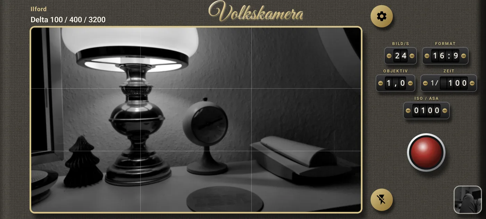
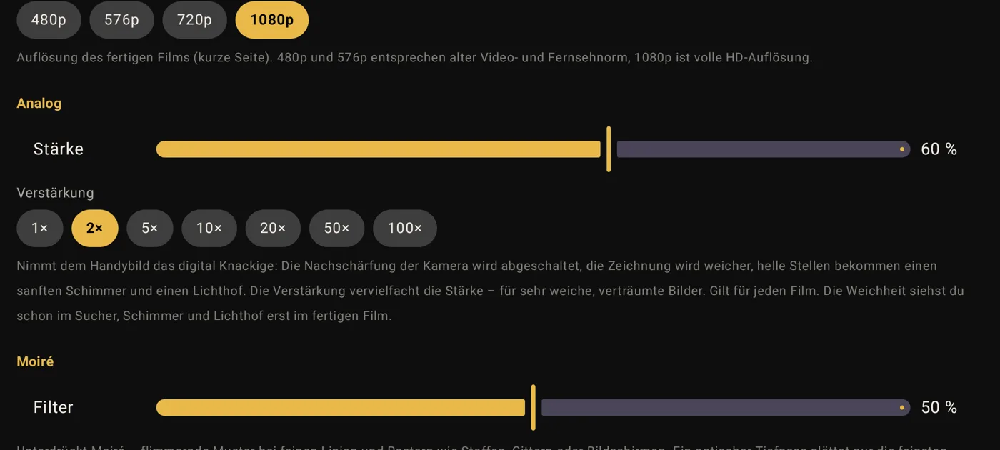
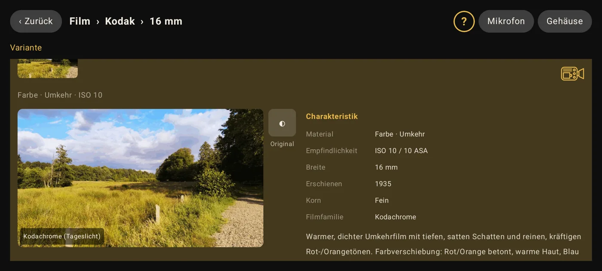
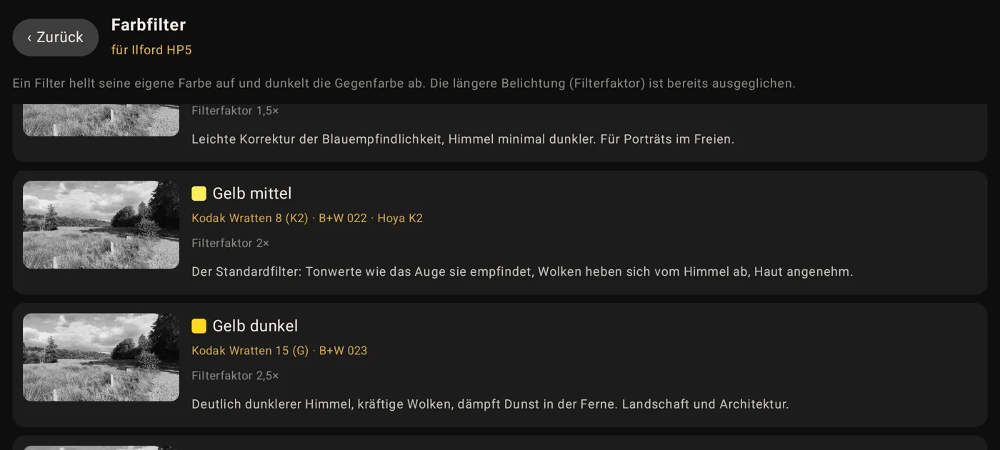
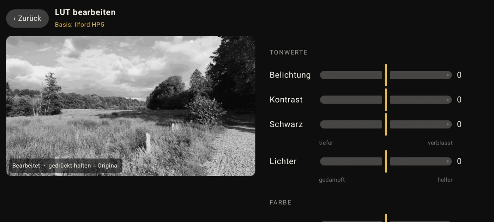
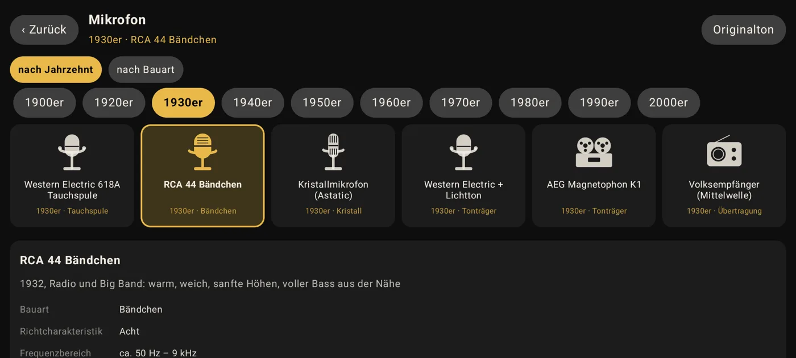
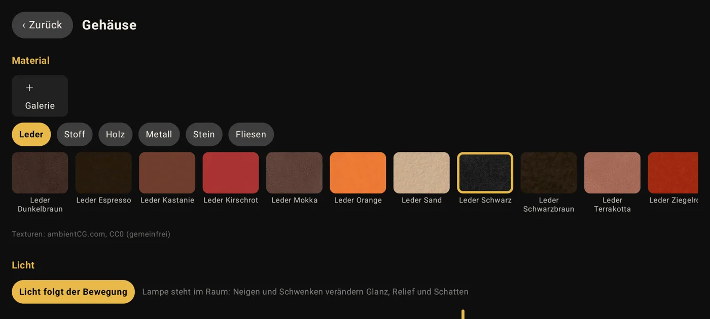
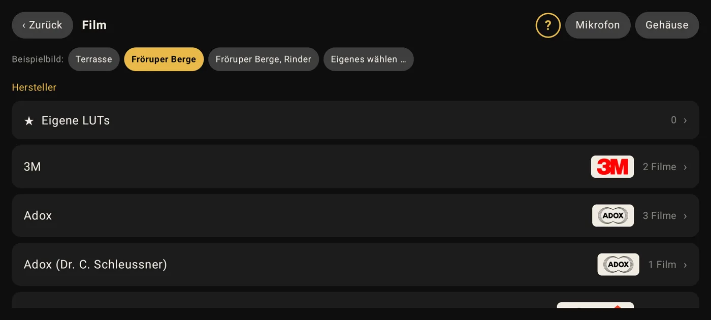

# Volkskamera

**The film camera for your Android phone.** Choose a real film stock – from the orthochromatic cinema film of the
1890s via Kodachrome and Agfacolor to today's slide film – and shoot with its colours, its contrast and its grain.
As with a real camera, every film has a fixed sensitivity; you control brightness with the shutter speed.

**Version 1.0** · Android 8.0 or newer · free · English, Deutsch, Français, Русский

➡️ **Download only here:** [volkskamera.goip.de](https://volkskamera.goip.de/en/) or under
[Releases](https://github.com/veritasX1/VolksKamera/releases). Volkskamera is free – a "premium" or "mod" APK from
any other site is always a fake.

🇩🇪 [Deutsch](https://volkskamera.goip.de/) · 🇫🇷 [Français](https://volkskamera.goip.de/fr/) ·
🇷🇺 [Русский](https://volkskamera.goip.de/ru/) · 📖 [Guide](https://volkskamera.goip.de/en/guide.html)

## Features
- **289 film stocks** from 26 manufacturers (8, 16 and 35 mm), each with profile, sample image and sources
- **Colour filters for B&W** (Kodak Wratten, B+W and Hoya names, filter factor, purpose)
- **Real exposure**: fixed film sensitivity, shutter speeds from 1/5 to 1/5000 – no auto mode, no re-exposure
- **Sensor calibration**: measures how your phone alters the image and compensates before every film
- **LUT editor**: adjust any film and save it as your own version
- **Analogue look**: switches off the phone’s built-in sharpening – soft rendering, glow and halation, boostable up to 100×
- **Moiré filter**: optical low-pass and full sensor readout for calm fabrics, fences and screens
- **50 microphones** from the Edison phonograph to the camcorder, plus noise, crackle and hum
- **Share combinations**: save film, filter and sound and pass them on as a short text
- **Mechanical counters** for frame rate, format, lens, shutter speed and ISO/ASA
- **Your camera body**: 127 materials with light that follows tilting and turning; your own lettering, four app icons

## Screenshots
Screenshots show the German interface; the app is fully available in English, French and Russian.

| | |
|---|---|
|  The camera |  Analogue look and moiré filter |
|  Film profile |  Colour filters for B&W |
|  LUT editor |  Microphones of the era |
|  Your camera body |  Film selection |

## Privacy
Volkskamera has **no internet permission**. It technically cannot send anything: no ads, no tracking, no accounts,
no cloud. Your recordings stay on your device. The source code is open so anyone can verify this.

## Version history
**1.0** – first stable release
- Everything from the 0.x betas, tested and stable: 289 film stocks, colour filters, real exposure, sensor calibration, LUT editor, 50 microphones, analogue look, moiré filter, your own camera body – in English, German, French and Russian

**0.9.0 beta**
- New: "Analogue" slider with boost (1×–100×) – switches off the phone’s built-in sharpening, softens the rendering and adds glow and halation; the softness is previewed live in the viewfinder
- New: separate sliders for gate weave, flicker and vignette
- New: moiré filter – optical low-pass for fine lines and grids; up to 30 fps the sensor is read in its full (non-binned) mode
- Available via F-Droid: add the repository from the website to get updates automatically

**0.8.2 beta**
- Fixed: film selection in portrait mode – no more large empty header, buttons no longer wrap

**0.8.1 beta**
- Fixed: switching on the LED no longer turns automatic exposure back on
- Fixed: changing white balance or exposure lock no longer discards the manual exposure

**0.8 beta**
- Available in English, French and Russian (switchable in the settings); one download per start language
- Fully manual exposure: sensor ISO follows the film ISO, shutter 1/5–1/5000, no re-exposure on focus or camera switch
- Sensor calibration (RAW vs. phone image) with step-by-step instructions
- Combinations: save and share film, filter and sound
- Recording resolution 480p–1080p; front camera can be mirrored
- The app never focuses by itself – tap the viewfinder to focus
- Fixed: crash when starting a recording

**0.7 beta** – first public beta

## Updating
Every release is signed with the same key (certificate SHA-256
`7806bf101cca62f7bd57a9e08d8e2d0514bd58888d4d94a78100064c46fbebfc`), so every new version installs over the previous one and keeps your settings.

## Licence
Free to use, not for sale – see [LICENSE.md](LICENSE.md). Third-party material: [QUELLEN.md](QUELLEN.md).

© since 2026 Olaf Winkler (veritasX1) · Developed in Schleswig-Holstein, Germany
